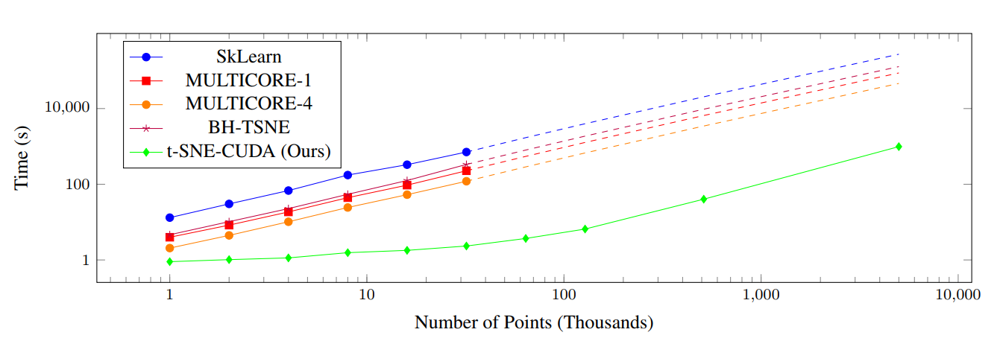
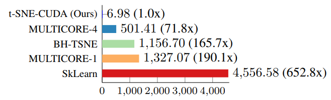
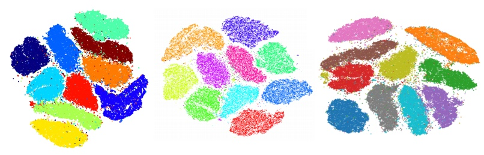

# TSNE-CUDA


This repo is an optimized CUDA version of [FIt-SNE algorithm](https://github.com/KlugerLab/FIt-SNE) with associated python modules. We find that our implementation of t-SNE can be up to 1200x faster than Sklearn, or up to 50x faster than Multicore-TSNE when used with the right GPU. The paper describing our approach, as well as the results below, is available at [https://arxiv.org/abs/1807.11824](https://arxiv.org/abs/1807.11824).

You can install binaries with anaconda for CUDA version 10.1 and 10.2 using `conda install tsnecuda -c conda-forge`. Tsnecuda supports CUDA versions 9.0 and later through source installation, check out the wiki for up to date installation instructions. [https://github.com/CannyLab/tsne-cuda/wiki/](https://github.com/CannyLab/tsne-cuda/wiki/)

# Benchmarks
### Simulated Data


Time taken compared to other state of the art algorithms on synthetic datasets with 50 dimensions and four clusters for varying numbers of points. Note the log scale on both the points and time axis, and that the scale of the x-axis is in thousands of points (thus, the values on the x-axis range from 1K to 10M points. Dashed lines on SkLearn, BH-TSNE, and MULTICORE-4 represent projected times. Projected scaling assumes an O(nlog(n)) implementation.

### MNIST


The performance of t-SNE-CUDA compared to other state-of-the-art implementations on the MNIST dataset. t-SNE-CUDA runs on the raw pixels of the MNIST dataset (60000 images x 768 dimensions) in under 7 seconds.

### CIFAR


The performance of t-SNE-CUDA compared to other state-of-the-art implementations on the CIFAR-10 dataset. t-SNE-CUDA runs on the output of a classifier on the CIFAR-10 training set (50000 images x 1024 dimensions) in under 6 seconds. While we can run on the full pixel set in under 12 seconds, Euclidean distance is a poor metric in raw pixel space leading to poor quality embeddings.

### Comparison of Embedding Quality
The quality of the embeddings produced by t-SNE-CUDA do not differ significantly from the state of the art implementations. See below for a comparison of MNIST cluster outputs.



Left: MULTICORE-4 (501s), Middle: BH-TSNE (1156s), Right: t-SNE-CUDA (Ours, 6.98s).

# Installation

To install our library, follow the [installation instructions](https://github.com/CannyLab/tsne-cuda/blob/master/INSTALL.md).

### Run

Like many of the libraries available, the python wrappers subscribe to the same API as [sklearn.manifold.TSNE](http://scikit-learn.org/stable/modules/generated/sklearn.manifold.TSNE.html).

You can run it as follows:

```
from tsnecuda import TSNE
X_embedded = TSNE(n_components=2, perplexity=15, learning_rate=10).fit_transform(X)
```

We only support `n_components=2`. We currently have no plans to support more dimensions as this requires significant changes to the code to accomodate.

For more information on running the library, or using it as a C++ library, see the [Python usage](https://github.com/CannyLab/tsne-cuda/wiki/Basic-Usage:-Python) or [C++ Usage](https://github.com/CannyLab/tsne-cuda/wiki/Basic-Usage:-Cxx) sections of the wiki.

# Citation

Please cite the corresponding paper if it was useful for your research:

```
@article{chan2019gpu,
  title={GPU accelerated t-distributed stochastic neighbor embedding},
  author={Chan, David M and Rao, Roshan and Huang, Forrest and Canny, John F},
  journal={Journal of Parallel and Distributed Computing},
  volume={131},
  pages={1--13},
  year={2019},
  publisher={Elsevier}
}
```

This library is built on top of the following technology, without this tech, none of this would be possible!

[L. Van der Maaten's paper](http://lvdmaaten.github.io/publications/papers/JMLR_2014.pdf)

[FIt-SNE](https://github.com/KlugerLab/FIt-SNE)

[Multicore-TSNE](https://github.com/DmitryUlyanov/Multicore-TSNE)

[BHTSNE](https://github.com/lvdmaaten/bhtsne/)

[CUDA Utilities/Pairwise Distance](https://github.com/OrangeOwlSolutions)

[LONESTAR-GPU](http://iss.ices.utexas.edu/?p=projects/galois/lonestargpu)

[FAISS](https://github.com/facebookresearch/faiss)

[GTest](https://github.com/google/googletest)

[CXXopts](https://github.com/jarro2783/cxxopts)


# License

Our code is built using components from FAISS, the Lonestar GPU library, GTest, CXXopts, and OrangeOwl's CUDA utilities. Each portion of the code is governed by their respective licenses - however our code is governed by the BSD-3 license found in LICENSE.txt
